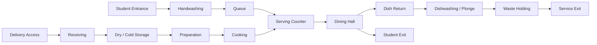

# DEMI PENSION BENAYAD KHLIFA 200 R — Architectural Design README

This repository is for using **Claude** and **Claude Code** as an architectural design assistant for the **physical design** of the demi-pension space/building.

The objective is **not** to build a software system to manage meals, students, payments, or administration. The objective is to help design the **architecture**: spatial organization, zoning, circulation, room program, kitchen/dining layout, safety, comfort, materials, and presentation documents.

---

## 1. Project Mission

Design a clear, functional, safe, and beautiful **demi-pension / school dining facility** for **BENAYAD KHLIFA 200 R**.

The design should support:

- Efficient student entry, queuing, serving, eating, and exit.
- Clean separation between public/student areas and kitchen/service areas.
- Hygienic food preparation, dishwashing, storage, and waste handling.
- Comfortable dining conditions: daylight, ventilation, acoustics, durability, and easy cleaning.
- Safe evacuation and simple supervision by staff.
- A design that can be explained through plans, diagrams, mood boards, and presentation boards.

---

## 2. What Claude Should Help Design

Claude should act as an **architectural design partner**, helping create and improve:

1. **Architectural brief**
   - Project goals
   - Users
   - Capacity
   - Constraints
   - Design priorities

2. **Site and context analysis**
   - Existing site conditions
   - Access points
   - Sun, wind, shade, and climate considerations
   - Existing buildings and circulation
   - Noise, safety, and service access

3. **Spatial program**
   - Required rooms and functions
   - Approximate area schedule
   - Capacity calculations
   - Priority spaces
   - Expansion possibilities

4. **Zoning strategy**
   - Student/public zone
   - Kitchen/preparation zone
   - Staff/service zone
   - Storage zone
   - Waste/delivery zone
   - Outdoor waiting or shaded transition areas

5. **Circulation design**
   - Student flow
   - Staff flow
   - Delivery flow
   - Dirty dish return flow
   - Waste removal flow
   - Emergency evacuation flow

6. **Concept options**
   - Option A: compact and efficient
   - Option B: courtyard/shaded approach
   - Option C: expandable modular solution

7. **Preliminary architectural layouts**
   - Text-based floor plan logic
   - Room adjacencies
   - Bubble diagrams
   - Mermaid diagrams
   - Simple SVG/block plan diagrams when useful

8. **Design review and improvement**
   - Identify weak points
   - Improve circulation
   - Improve hygiene separation
   - Improve user comfort
   - Improve facade and materials

9. **Presentation package**
   - Concept statement
   - Design narrative
   - Room schedule
   - Diagrams
   - Image-generation prompts
   - Final design checklist

---

## 3. What Claude Should NOT Do

Claude should **not** transform this project into a management software project.

Do **not** focus on:

- Student payment tracking
- Meal attendance systems
- Menus and nutrition management
- Inventory software
- Parent portals
- Admin dashboards
- Databases for student records
- Canteen accounting
- Web apps or mobile apps

Claude Code may be used only to organize design files, markdown notes, diagrams, SVG sketches, and presentation content.

---

## 4. Recommended Repository Structure

Create this structure in the project folder:

```text
DEMI-PENSION-BENAYAD-KHLIFA-200-R/
│
├── README.md
├── CLAUDE.md
│
├── 00_sources/
│   ├── site_photos/
│   ├── existing_plans/
│   ├── measurements/
│   ├── references/
│   └── regulations_notes/
│
├── 01_brief/
│   ├── architectural_brief.md
│   ├── users_and_capacity.md
│   ├── constraints.md
│   └── questions_to_confirm.md
│
├── 02_site_analysis/
│   ├── site_summary.md
│   ├── sun_wind_access.md
│   ├── existing_circulation.md
│   └── opportunities_and_risks.md
│
├── 03_program/
│   ├── room_schedule.md
│   ├── area_calculations.md
│   ├── adjacency_matrix.md
│   └── functional_requirements.md
│
├── 04_concepts/
│   ├── concept_A_compact.md
│   ├── concept_B_courtyard.md
│   ├── concept_C_modular.md
│   └── concept_comparison.md
│
├── 05_layouts/
│   ├── zoning_diagrams.md
│   ├── circulation_diagrams.md
│   ├── preliminary_plan_notes.md
│   └── plan_review.md
│
├── 06_design_language/
│   ├── materials.md
│   ├── facade_ideas.md
│   ├── interior_atmosphere.md
│   └── lighting_ventilation_acoustics.md
│
├── 07_visual_prompts/
│   ├── exterior_prompts.md
│   ├── dining_hall_prompts.md
│   ├── kitchen_service_prompts.md
│   └── presentation_board_prompts.md
│
├── 08_reviews/
│   ├── hygiene_review.md
│   ├── safety_review.md
│   ├── accessibility_review.md
│   └── final_architecture_checklist.md
│
└── 09_outputs/
    ├── final_design_narrative.md
    ├── final_room_schedule.md
    ├── final_presentation_text.md
    └── final_board_structure.md
```

---

## 5. Essential Source Information to Provide Claude

Before asking Claude to design, collect as many of these as possible.

### 5.1 Site Information

- Site location
- Existing building dimensions
- Available land/room dimensions
- Entrances and exits
- Nearby classrooms, courtyards, roads, and service access
- Photos from all sides
- Existing floor plans, even if hand drawn
- North direction
- Sun exposure
- Wind direction if known
- Noise sources
- Drainage or slope issues

### 5.2 Capacity Information

- Number of students served per day
- Number of students served at the same time
- Number of meal shifts
- Age group of students
- Number of staff
- Seating style: fixed benches, loose tables, mixed seating, or flexible hall
- Desired future expansion capacity

### 5.3 Kitchen and Service Information

- Food prepared on site or delivered?
- Cooking type: full cooking, reheating, serving only, or mixed system
- Need for cold storage?
- Need for dry storage?
- Dishwashing on site?
- Waste collection point
- Delivery vehicle access
- Staff changing area required?
- Staff toilets required?

### 5.4 Design Preferences

- Modern, traditional, simple, institutional, warm, or playful style
- Preferred materials
- Budget level: low, medium, or high
- Climate response: shade, ventilation, thermal comfort
- Security and supervision needs
- Desired image of the school

### 5.5 Regulatory and Technical Information

These must be checked locally by a qualified professional:

- Fire safety rules
- Kitchen hygiene rules
- Accessibility requirements
- Structural requirements
- Plumbing and drainage requirements
- Electrical and gas safety rules
- Ventilation/extraction requirements
- Local building permit requirements

Claude can help organize and reason about these, but final validation must be done by a licensed architect, engineer, and relevant local authorities.

---

## 6. Core Architectural Design Principles

Use these principles throughout the design process.

### 6.1 Clear Zoning

Separate the building into logical zones:

- **Student zone:** entry, queue, dining, exit, toilets if required.
- **Food service zone:** serving counter, tray pickup, dish return.
- **Kitchen zone:** preparation, cooking, plating, washing.
- **Storage zone:** dry storage, cold storage, cleaning storage.
- **Service zone:** delivery, waste, staff access, technical spaces.

The student route should be simple and visible. The service route should avoid crossing the student route when possible.

### 6.2 One-Way Student Flow

A good demi-pension plan should avoid congestion.

Preferred flow:

```text
Entrance → Handwashing / Queue → Tray Pickup → Serving → Dining → Dish Return → Exit
```

Avoid designs where students must go backward, cross dirty dish routes, or pass through kitchen/service areas.

### 6.3 Clean and Dirty Separation

Food preparation and dishwashing/waste should not mix.

Preferred logic:

```text
Delivery → Storage → Preparation → Cooking → Serving → Dining → Dish Return → Dishwashing → Waste
```

Clean food movement and dirty dish/waste movement should be separated as much as possible.

### 6.4 Supervision and Safety

Staff should be able to supervise:

- Entrance and queue
- Serving line
- Dining hall
- Dish return
- Main exit

Avoid hidden corners, narrow bottlenecks, and confusing circulation.

### 6.5 Climate Comfort

For Algerian/local climate conditions, prioritize:

- Shaded waiting area
- Cross ventilation
- High ceilings where possible
- Durable thermal envelope
- Controlled direct sun
- Easy-to-clean but comfortable surfaces
- Natural daylight without glare

### 6.6 Durability and Maintenance

A demi-pension must survive heavy daily use.

Prioritize:

- Washable wall finishes
- Non-slip flooring
- Impact-resistant corners
- Simple plumbing maintenance access
- Durable tables and benches
- Easy cleaning below furniture
- Clear waste management points

---

## 7. Functional Zones and Room Checklist

Claude should consider these spaces when proposing the design.

### Student / Public Areas

- Covered entrance
- Waiting / queue area
- Handwashing point
- Tray pickup
- Serving line
- Dining hall
- Drinking water point
- Dish return point
- Student toilets if required
- Exit route
- Emergency exits
- Outdoor shaded overflow area if possible

### Kitchen / Food Preparation Areas

- Food receiving area
- Dry storage
- Cold storage
- Vegetable/meat/prep area depending on kitchen type
- Cooking area
- Plating/serving support area
- Serving counter
- Dishwashing / plonge
- Cleaning materials storage
- Waste holding area

### Staff / Service Areas

- Staff entrance
- Staff changing room
- Staff toilet
- Small office or control point if needed
- Delivery access
- Service yard
- Technical room if required

---

## 8. Adjacency Logic

Use this as a starting point for room relationships.

### Must Be Close

- Kitchen ↔ Serving counter
- Serving counter ↔ Dining hall
- Dish return ↔ Dishwashing
- Delivery ↔ Storage
- Storage ↔ Preparation
- Waste ↔ Service exit
- Handwashing ↔ Student queue / dining entrance

### Should Be Separated

- Waste from dining hall
- Dishwashing from clean preparation
- Delivery route from student entrance
- Staff/private areas from student dining area
- Toilets from kitchen/food prep areas
- Noisy service spaces from main dining if possible

### Mermaid Adjacency Diagram

Claude can use Mermaid diagrams like this:



---

## 9. Claude Design Workflow

Follow this workflow. Do not jump directly to a final design.

### Phase 1 — Understand the Sources

Claude should first read all available sources and create:

- `01_brief/questions_to_confirm.md`
- `01_brief/constraints.md`
- `02_site_analysis/site_summary.md`

Claude should clearly separate:

- Known facts
- Assumptions
- Missing information
- Design risks

### Phase 2 — Create the Architectural Brief

Claude should create:

- Project vision
- Users
- Capacity assumptions
- Functional requirements
- Design priorities
- Technical constraints

Output file:

```text
01_brief/architectural_brief.md
```

### Phase 3 — Build the Spatial Program

Claude should produce:

- Room list
- Approximate area range
- Functional notes
- Priority level
- Required adjacency

Output files:

```text
03_program/room_schedule.md
03_program/area_calculations.md
03_program/adjacency_matrix.md
```

### Phase 4 — Propose 3 Concept Options

Claude should create three different architectural concepts:

1. **Compact efficient plan**
2. **Courtyard / shaded transition plan**
3. **Modular expandable plan**

Each concept should include:

- Main idea
- Strengths
- Weaknesses
- Best use case
- Zoning logic
- Circulation logic
- Possible facade/material direction

Output files:

```text
04_concepts/concept_A_compact.md
04_concepts/concept_B_courtyard.md
04_concepts/concept_C_modular.md
04_concepts/concept_comparison.md
```

### Phase 5 — Develop the Best Concept

After comparing concepts, Claude should develop the strongest option into:

- Zoning diagram
- Circulation diagram
- Preliminary plan description
- Room adjacency explanation
- Design narrative

Output files:

```text
05_layouts/zoning_diagrams.md
05_layouts/circulation_diagrams.md
05_layouts/preliminary_plan_notes.md
```

### Phase 6 — Review the Architecture

Claude should review the design against:

- Hygiene
- Fire safety logic
- Accessibility
- Student supervision
- Kitchen functionality
- Maintenance
- Comfort
- Expansion

Output files:

```text
08_reviews/hygiene_review.md
08_reviews/safety_review.md
08_reviews/accessibility_review.md
08_reviews/final_architecture_checklist.md
```

### Phase 7 — Prepare Visual and Presentation Materials

Claude should generate:

- Exterior image prompts
- Interior dining hall prompts
- Kitchen/service prompts
- Presentation board structure
- Final design narrative

Output files:

```text
07_visual_prompts/exterior_prompts.md
07_visual_prompts/dining_hall_prompts.md
07_visual_prompts/kitchen_service_prompts.md
09_outputs/final_design_narrative.md
09_outputs/final_board_structure.md
```

---

## 10. Suggested CLAUDE.md Instructions

Create a `CLAUDE.md` file in the project root with the following content:

```markdown
# Claude Instructions — Demi Pension Architectural Design

You are helping design the physical architecture of a demi-pension / school dining facility for BENAYAD KHLIFA 200 R.

You are not designing a software management system.

Your role is to act as an architectural design assistant. Help with architectural brief, site analysis, spatial program, zoning, circulation, preliminary layouts, room adjacencies, hygiene/safety review, materials, facade ideas, and presentation content.

Always distinguish between:

- Known facts from provided sources
- Assumptions
- Missing information
- Design recommendations
- Items that require validation by a licensed architect, engineer, or local authority

Do not invent exact dimensions unless the user provides measurements. When dimensions are missing, propose ranges and clearly label them as assumptions.

Prioritize:

1. Student safety
2. Hygiene and clean/dirty separation
3. Clear one-way circulation
4. Durable and easy-to-maintain materials
5. Climate comfort: shade, ventilation, daylight
6. Efficient kitchen and service workflow
7. Simple supervision by staff
8. Future expansion if possible

Do not focus on meal management, payment systems, student databases, dashboards, or software features.

When creating design documents, save them in the appropriate folders:

- `01_brief/`
- `02_site_analysis/`
- `03_program/`
- `04_concepts/`
- `05_layouts/`
- `06_design_language/`
- `07_visual_prompts/`
- `08_reviews/`
- `09_outputs/`

Use clear Markdown tables, Mermaid diagrams, checklists, and concise architectural explanations.
```

---

## 11. First Prompt to Give Claude / Claude Code

Use this prompt after placing sources in the `00_sources/` folder:

```text
You are helping me design the physical architecture of a demi-pension / school dining facility for BENAYAD KHLIFA 200 R.

Important: This is not a software project. Do not design a management app, meal tracking system, student database, payment system, or admin dashboard.

Your job is to help me design the architecture: spatial program, zoning, circulation, kitchen/dining layout, hygiene separation, safety, comfort, materials, facade ideas, and presentation documents.

Please start by reviewing the available project sources in `00_sources/`. Then create the following files:

1. `01_brief/questions_to_confirm.md`
2. `01_brief/constraints.md`
3. `01_brief/architectural_brief.md`
4. `02_site_analysis/site_summary.md`
5. `03_program/initial_room_schedule.md`

In every file, separate:

- Known facts
- Assumptions
- Missing information
- Design risks
- Recommendations

Do not invent final dimensions. If dimensions are missing, propose reasonable area ranges and clearly mark them as assumptions.

The design must prioritize student safety, hygiene, clean/dirty separation, one-way circulation, shaded waiting, ventilation, durability, and easy supervision.
```

---

## 12. Prompt for Creating Concept Options

After the brief and room schedule are created, use:

```text
Based on the architectural brief, site analysis, and room schedule, propose 3 architectural concept options for the demi-pension:

A. Compact efficient layout
B. Courtyard / shaded transition layout
C. Modular expandable layout

For each option, provide:

- Concept idea
- Zoning logic
- Student circulation
- Staff/service circulation
- Kitchen workflow
- Hygiene strategy
- Strengths
- Weaknesses
- Best use case
- Approximate spatial organization
- Mermaid bubble diagram

Save the results in:

- `04_concepts/concept_A_compact.md`
- `04_concepts/concept_B_courtyard.md`
- `04_concepts/concept_C_modular.md`
- `04_concepts/concept_comparison.md`
```

---

## 13. Prompt for Reviewing a Layout

Use this whenever a plan or sketch is produced:

```text
Review this demi-pension architectural layout as an architect.

Evaluate it for:

1. Student entrance and exit flow
2. Queue and serving efficiency
3. Dining hall comfort
4. Clean/dirty separation
5. Kitchen workflow
6. Dish return and dishwashing logic
7. Delivery and waste route
8. Emergency evacuation logic
9. Accessibility
10. Staff supervision
11. Ventilation and daylight
12. Durability and maintenance
13. Possible future expansion

Give a clear critique with:

- What works well
- What is risky or weak
- What should be changed
- Priority improvements
- Suggested revised zoning

Do not discuss software management features.
```

---

## 14. Prompt for Image / Visualization Generation

Use this when creating prompts for exterior or interior visuals:

```text
Create image-generation prompts for the architectural design of a school demi-pension for BENAYAD KHLIFA 200 R.

The design should feel durable, clean, welcoming, and appropriate for a school dining facility. It should include shaded waiting areas, natural ventilation, simple modern materials, easy supervision, and a clear student entrance.

Create prompts for:

1. Exterior view from student entrance
2. Dining hall interior
3. Serving counter and queue area
4. Courtyard or shaded outdoor transition area
5. Presentation board hero image

For each prompt include:

- Architectural style
- Materials
- Lighting
- Climate response
- People/use scenario
- Camera angle
- Mood

Avoid luxury restaurant design. This must look like a practical, safe, durable school facility.
```

---

## 15. Architecture Review Checklist

Before accepting any design option, check the following.

### Function

- [ ] Students can enter, queue, eat, return dishes, and exit without confusion.
- [ ] The serving line does not block the entrance.
- [ ] Dish return does not cross the food-serving line.
- [ ] Kitchen has logical receiving, storage, preparation, cooking, serving, and washing flow.
- [ ] Waste route is separated from student dining as much as possible.

### Safety

- [ ] Emergency exits are clear.
- [ ] Circulation paths are not too narrow for peak use.
- [ ] Queuing does not create dangerous crowding.
- [ ] Staff can supervise key areas.
- [ ] Wet zones use non-slip flooring.

### Hygiene

- [ ] Clean and dirty flows are separated.
- [ ] Handwashing is near student entry/serving.
- [ ] Toilets are separated from food preparation.
- [ ] Waste is not stored near dining or clean food prep.
- [ ] Dishwashing is close to dish return but separated from clean preparation.

### Comfort

- [ ] Dining hall has daylight.
- [ ] Dining hall has ventilation.
- [ ] Waiting/queue area has shade.
- [ ] Noise and echo are considered.
- [ ] Heat gain is reduced through shade, orientation, or ventilation.

### Durability

- [ ] Materials are easy to clean.
- [ ] Floors are non-slip and durable.
- [ ] Walls can resist impact and washing.
- [ ] Furniture layout supports cleaning.
- [ ] Service areas are accessible for maintenance.

### Design Quality

- [ ] The building has a clear entrance identity.
- [ ] The design feels appropriate for a school.
- [ ] The facade is simple, durable, and welcoming.
- [ ] The plan can adapt to future growth if needed.
- [ ] The concept is easy to explain in a presentation.

---

## 16. Final Expected Deliverables

The final design process should produce:

- Architectural brief
- Site analysis summary
- Room schedule
- Area assumptions
- Adjacency matrix
- 3 concept options
- Concept comparison
- Selected concept narrative
- Zoning diagram
- Circulation diagram
- Preliminary floor plan explanation
- Material and facade direction
- Hygiene review
- Safety review
- Accessibility review
- Visualization prompts
- Final presentation board structure

---

## 17. Professional Validation Note

Claude can help reason, organize, critique, and generate architectural design documents. However, the final design must be reviewed and approved by qualified professionals, including the architect, structural engineer, MEP engineer, fire safety authority, hygiene/food safety authority, and local permitting authorities.

Do not treat AI output as final construction documentation.

---

## 18. Design Direction Summary

The best demi-pension architecture should be:

- Simple to understand
- Safe for students
- Efficient during peak meal time
- Hygienic and easy to clean
- Comfortable in local climate
- Durable under heavy use
- Easy for staff to supervise
- Clear in its separation between students, food preparation, service, and waste
- Presentable as a strong school facility design

The goal is not only to create a building that works, but also a space that feels organized, clean, welcoming, and respectful for students.
